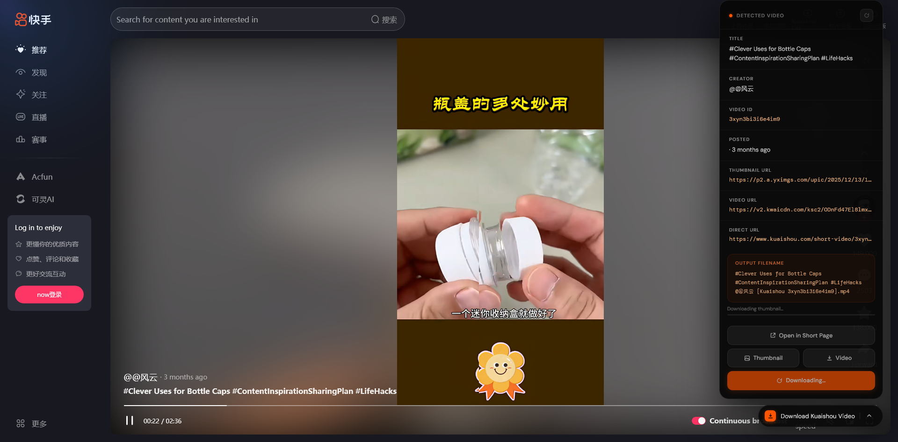

# Kuaishou Video Downloader

A browser extension for extracting and downloading videos from Kuaishou (快手). Supports all Chromium-based browsers (Chrome, Edge, Brave, Opera) and Firefox.


[](https://addons.mozilla.org/en-US/firefox/addon/kuaishou-video-downloader/)

## Screenshot



## Features

- **Quick Access** - Click the extension icon to open Kuaishou feed
- **Detect Videos Automatically** - Detects videos on feed pages and short-video pages
- **Download Options**:
  - Download video only
  - Download thumbnail only  
  - Download both video and thumbnail
- **Copy to Clipboard** - Click any field to copy (title, creator, video URL, thumbnail URL, etc.)
- **Works on All Pages**:
  - Home feed / recommendations
  - Short-video direct pages (`/short-video/{id}`)
- **Clean UI** - Modern dark theme with click-to-copy feedback

## Installation

### Download Source Code

Clone or download the source code from GitHub:

```bash
git clone https://github.com/codebyhasan/kuaishou-video-downloader.git
```

Or download as ZIP from the Code button on the repository page.

### Chrome, Edge, Brave, Opera (Chromium-based)

1. Use the `chrome/` folder
2. Open Chrome and navigate to `chrome://extensions`
3. Enable "Developer mode" (toggle in top-right)
4. Click "Load unpacked"
5. Select the `chrome` folder

### Firefox (Temporary Installation)

1. Use the `firefox/` folder
2. Open Firefox and navigate to `about:debugging#/runtime/this-firefox`
3. Click "Load Temporary Add-on..."
4. Select `firefox/manifest.json`

### Firefox (Recommended)

[](https://addons.mozilla.org/en-US/firefox/addon/kuaishou-video-downloader/)

Install directly from Mozilla Add-ons.

**Note:** Temporary add-ons are removed when Firefox closes. For permanent installation, install from Mozilla Add-ons.

## Usage

1. Visit any Kuaishou page (feed or short-video)
2. Click the download pill icon in the bottom-right corner
3. The panel shows detected video info:
   - Title, Creator, Video ID, Posted date
   - Thumbnail URL, Video URL, Direct URL (all clickable to copy)
4. Use buttons to download or click fields to copy

## Files

```
kuaishou-video-downloader/
├── chrome/              # Chrome/Chromium version
│   ├── manifest.json
│   ├── content.js
│   ├── background.js
│   └── icons/
├── firefox/             # Firefox version
│   ├── manifest.json
│   ├── content.js
│   ├── background.js
│   └── icons/
├── README.md
└── description.md
```

## Permissions

- `clipboardWrite` - For copying video info to clipboard
- `clipboardRead` - For clipboard operations
- `tabs` - For opening Kuaishou when clicking the extension icon

## Supported Pages

- `https://www.kuaishou.com/` - Home feed
- `https://www.kuaishou.com/short-video/*` - Direct video pages
- `https://www.kuaishou.com/short-video/feed/*` - Video feed

## License

MIT License - Feel free to use and modify.

---

**Note:** This extension is for personal use only. Respect copyright and terms of service when downloading content.
